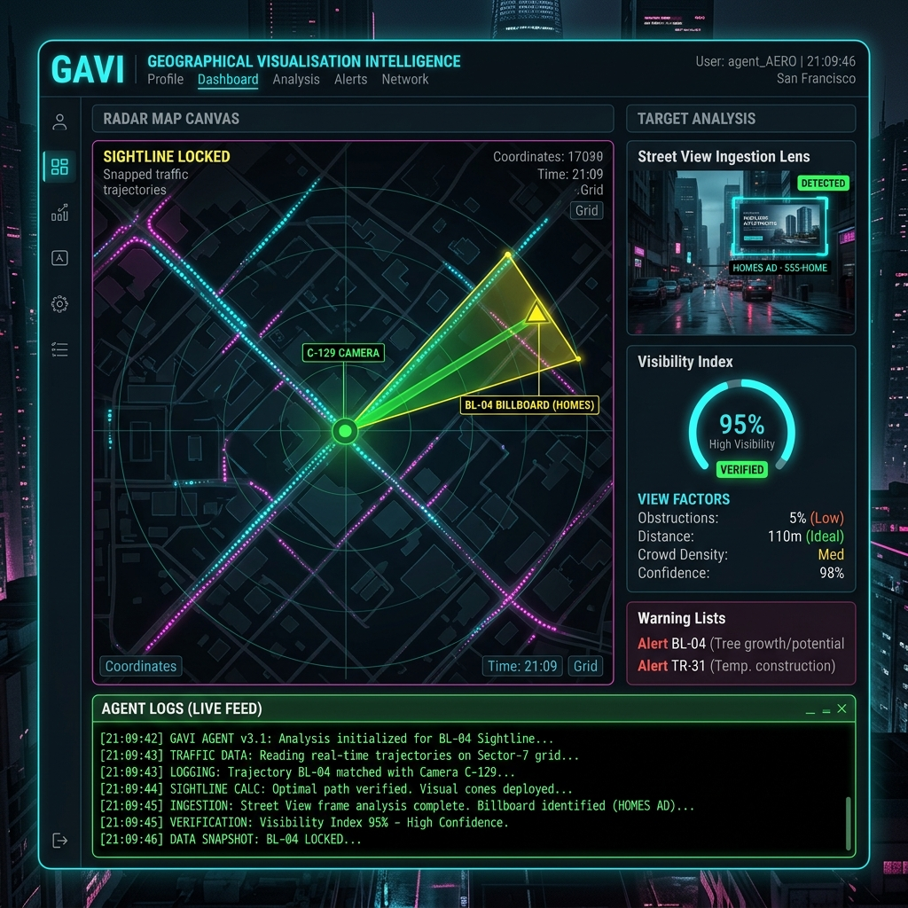

# 🗺️ GAVI — Geographical Visualisation Intelligence (Immersion 2.0)

<p align="center">
  
  
  
</p>

Welcome to the command center for **GAVI (Geographical Visualisation Intelligence)**. GAVI is a spatial analytics and visual verification engine designed to ingest billboard parameters, fetch perspective frames from Google Maps 360° Street View, use the Gemini 2.5 Flash VLM to validate real-world brand visibility, and compute traffic-adjusted exposure metrics.

---

## 🏛️ Workspace Architecture

This repository is set up as an npm workspaces monorepo:

```
Immersion 2.0 (Another Idea)/
├── README.md                           # Core landing hub (This file)
├── .gitignore                          # Excludes build assets, local db, and credentials
├── Dockerfile                          # Multi-stage production container build
├── cloudbuild.yaml                     # Automated Google Cloud Build schema
├── package.json                        # Root workspaces config
├── tsconfig.json                       # TS compiler options
│
└── packages/                           # Monorepo Packages
    ├── core/                           # SQLite database connection, seeding, and schema
    ├── math/                           # Geometric intersection, snapping, & exposure math
    ├── api/                            # Express server for trajectory matching and VLM check
    └── console/                        # React + Canvas cyberpunk visualizer dashboard
```

---

## ⚡ GAVI Visibility Model

GAVI maps physical space using a custom mathematical model to verify real-world exposure:

```
                     \   /
                      \ /
                       ▼ Billboard Location (Lat, Lng) facing angle (θ)
                      
   === Road Lane A ===► Direction: Vehicle heading opposite to face (VISIBLE)
   === Road Lane B ===◄ Direction: Vehicle heading same as face (NOT VISIBLE)
   
   ● Pedestrian C (Walking inside cone - VISIBLE regardless of heading)
```

1. **The Visual Cone ($V_{poly}$):** Spans a $120^\circ$ arc centered on the billboard face normal. Vehicles or pedestrians must fall within this sector (distance $d \le R$) to be considered potential viewers.
2. **Vehicular Heading Constraint:** A vehicle must drive *towards* the face:
   $$|\theta_{veh} - (\theta_{bb} + 180^\circ)| \pmod{360^\circ} \le 90^\circ$$
3. **Pedestrian Constraint:** Omnidirectional visibility is assumed due to ambient sightlines.

---

## 🖥️ GAVI Dashboard Interface & Screen Overview

To map, test, and analyze visual exposure probabilities, GAVI provides a premium visual interface.

### 📊 Spatial Discovery & Probability Dashboard
Below is the dashboard showing the active 360° ingestion lens, spatial math radar canvas, and live exposure stats:

<p align="center">
  
</p>

### 🔍 How GAVI Maps & Tests Visibility Probabilities:

1. **Interactive Street View Ingestion Lens (Top Right):**
   * Displays a live `google.maps.StreetViewPanorama` camera view. You can pan, navigate, and double-click.
   * **Adjustable Viewport:** The container has a vertical resizer handle (drag height between `150px` and `600px` to resize) to customize layout space without rendering grey pixels.
   * **Click-to-Select Placement:** Click anywhere inside the 360° panorama to project visual placement coordinates and facing vectors directly into the Ingress Form.
   
2. **Spatial Math Radar Canvas (Center Workspace):**
   * Computes geodetic offsets to draw the **Billboard Exposure Cone** ($120^\circ$ aperture) and the **Camera POV Cone** ($90^\circ$ FOV).
   * **Sightline locking connector:** Dynamically draws a solid green connection line labeled `SIGHTLINE LOCKED` when camera angles intersect and face the billboard, or a dashed red line if blocked or out of view.
   * **Traffic flow simulations:** Animates vehicles (cyan dots) and pedestrians (magenta dots) moving along snapped road nodes. Particles glow upon entering active billboard exposure zones to map seen probabilities in real-time.
   
3. **Billboard Visibility Index (BVI) Panel (Right Sidebar):**
   * Calculates overall visibility percentages based on distance attenuation, camera angles, travel heading directions, and VLM (Gemini 2.5 Flash) object confidence scores.
   * Renders a color-coded status badge (`EXCELLENT` in green, `GOOD` in yellow, `POOR` in pink, `NOT VISIBLE` in gray) and gives placement suggestions (e.g., face rotation coordinates).

4. **Reference Ad Creative Validation:**
   * GAVI uploads ad designs as reference targets to detect matching visual boundaries. Below is a high-fidelity creative design asset generated for testing target brand identification:

<p align="center">
  
</p>

---

## 🚀 Easy Local Setup & Run

Follow these simple steps to set up and run GAVI locally on your machine.

### Prerequisites
- **Node.js** (v18.x or higher)
- **npm** (v9.x or higher)

### Step 1: Clone the Repo & Install Dependencies
Clone the repository and run install from the root directory to configure the workspace hoisting:
```bash
git clone <your-repo-link>
cd "Immersion 2.0 (Another Idea)"
npm install
```

### Step 2: Build the Monorepo
Compile TypeScript modules and build the static console pages:
```bash
npm run build
```

### Step 3: Run the Application
You can run GAVI in either **Development Mode** (with hot reload enabled) or **Production Mode** (single port server).

#### A. Development Mode (Hot Reloading Console + API Server)
Spins up both packages concurrently:
```bash
npm run dev
```
* **Frontend Dashboard Console:** `http://localhost:3000`
* **Backend Ingestion Server:** `http://localhost:3001`

#### B. Production Mode (Single port serving serve-static Console + API)
Builds and serves both packages statically as a single self-contained unit on one port:
```bash
npm start
```
* **Unified Application Port:** `http://localhost:3001` (serving both index and API requests).

---

## ☁️ Google Cloud Run Deployment

GAVI is package-ready for containerized deployment to Google Cloud Run. 

### Local Docker Test
To verify the Docker container behaves correctly locally before deploying:
```bash
# Build the container
docker build -t gavi-app .

# Run the container (Map port 3001)
docker run -p 3001:3001 \
  --env GOOGLE_MAPS_API_KEY="your_maps_key" \
  --env GEMINI_API_KEY="your_gemini_key" \
  gavi-app
```
Open your browser at `http://localhost:3001` to verify.

### Deploy to Google Cloud Run
Deploy dynamically to Cloud Run in one command:
```bash
gcloud run deploy gavi-spatial-gateway \
  --source . \
  --port 3001 \
  --allow-unauthenticated \
  --region us-central1
```

Once the deploy completes, Google Cloud will output the live HTTPS URL for your GAVI Gateway command center.

---

## 🔑 API Keys Configuration

To perform 360° scans, geocoding address searches, and Gemini VLM visual validations, GAVI requires valid API credentials:

1. **Google Maps API Key:** Needs permission for **Street View Static API**, **Roads API**, and **Geocoding API**.
2. **Gemini API Key:** An active key from **Google AI Studio** (`gemini-2.5-flash` model).

### How to Authenticate
- **Via the Console Dashboard:** Paste your keys directly into the **Cloud Auth Credentials** panel in the sidebar and click **Authenticate**. (Keys are securely saved in your browser's local storage and synced to the active server node in memory).
- **Via Environment File:** Create a `.env` file at the root of the project:
  ```env
  PORT=3001
  GOOGLE_MAPS_API_KEY=your_google_maps_key
  GEMINI_API_KEY=your_gemini_api_key
  NODE_ENV=development
  ```

---

## 🧪 Automated Testing

Verify the dynamic visual validation, snapping, daily report aggregation, and storage purge deletion pipeline by running our automated integration script:

```bash
# Build the monorepo first
npm run build

# Run the E2E verification/delete test
npx tsx packages/api/src/test-delete.ts
```

*Note: Ensure you have populated your API keys inside the `.env` file prior to running this script, as the test verifies active, live VLM checks.*
